# Ejemplo: Programación lineal con Solver en Excel

En este ejemplo se muestra cómo resolver un problema de programación lineal utilizando Excel Solver.

## Modelo matemático

Maximizar:

Z = 10X + 8Y

Sujeto a:

30X + 20Y ≤ 120  
2X + 2Y ≤ 9  
4X + 6Y ≤ 24  


## Paso 1: Construir la tabla en Excel

Organiza los datos del problema en una tabla que incluya:

- Coeficientes de la función objetivo
- Variables de decisión
- Restricciones

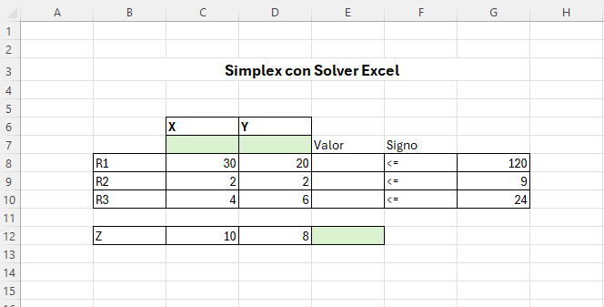


## Paso 2: Definir las restricciones

Para cada restricción, utiliza la función `SUMAPRODUCTO` para calcular el lado izquierdo de la expresión.

```excel
=SUMAPRODUCTO($C$7:$D$7,C8:D8)
```

Esta fórmula multiplica los coeficientes de cada restricción por las variables de decisión.

Aplica este mismo procedimiento para cada una de las restricciones del modelo.

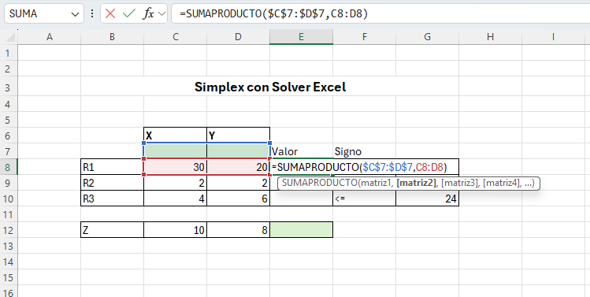

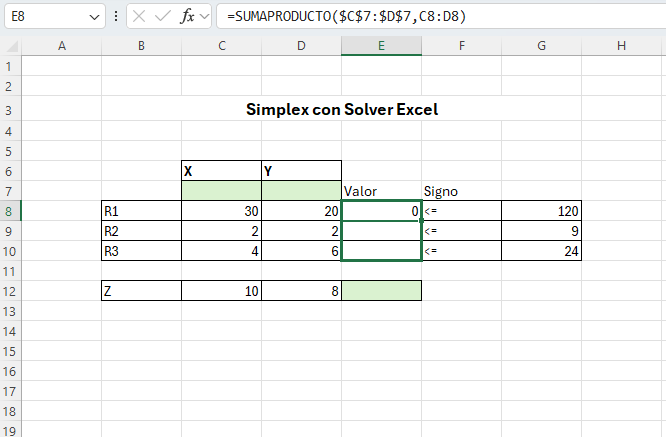


## Paso 3: Definir la función objetivo

Utiliza la función `SUMAPRODUCTO` para calcular el valor de la función objetivo.

```excel
=SUMAPRODUCTO($C$7:$D$7,C12:D12)
```
Esta fórmula multiplica los coeficientes de la función objetivo por las variables de decisión.

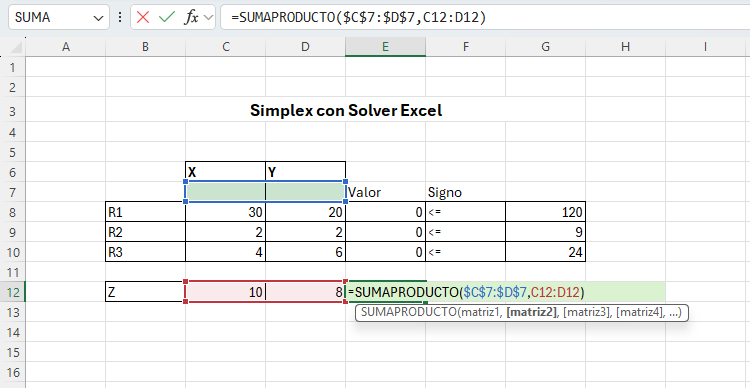


## Paso 4: Abrir Solver

Dirígete a:

**Datos → Solver**

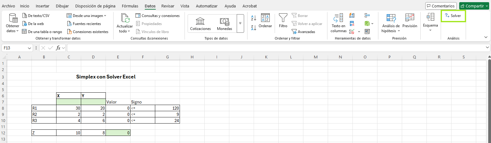


## Paso 5: Configurar la función objetivo

En Solver:

- Selecciona la celda donde se calcula Z  
- Define el objetivo como **Máx**

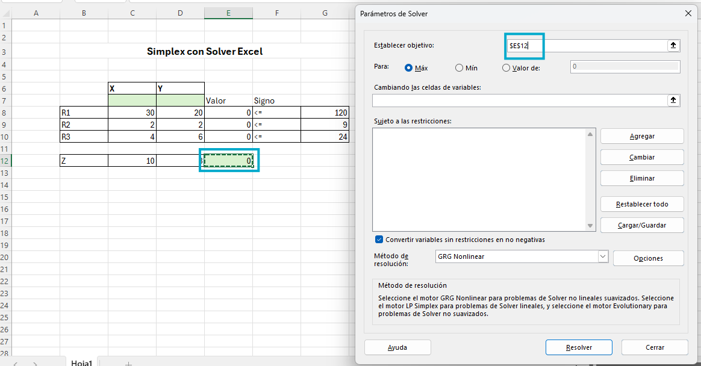


## Paso 6: Seleccionar variables de decisión

Selecciona las celdas correspondientes a las variables X y Y.

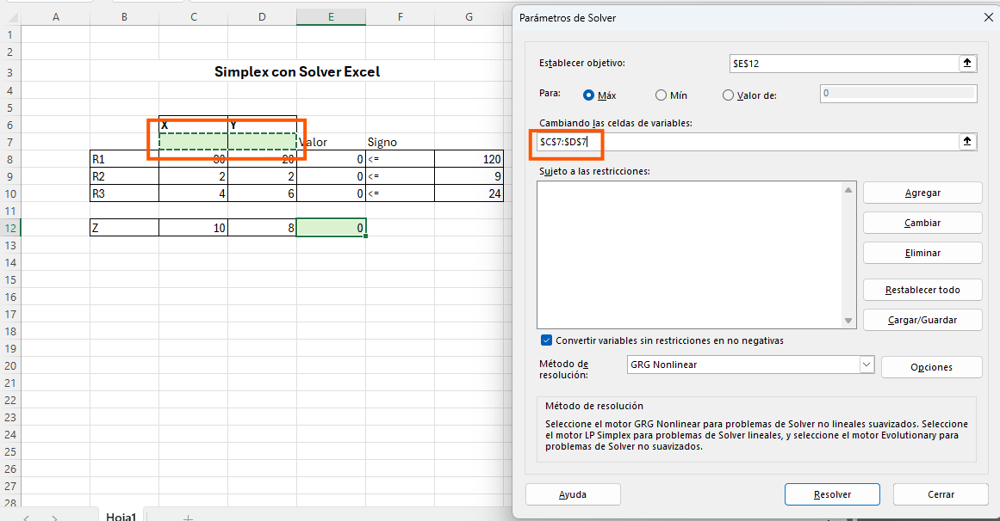


## Paso 7: Agregar restricciones

Agrega cada una de las restricciones del modelo en Solver.

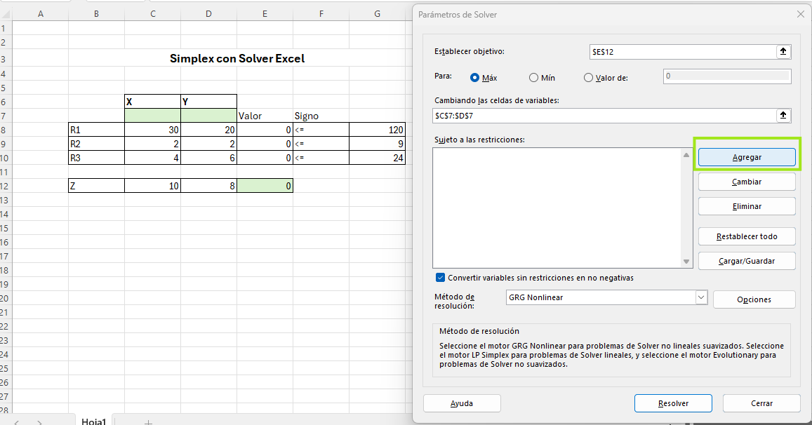

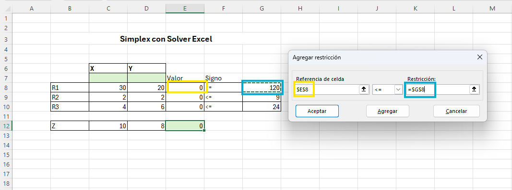
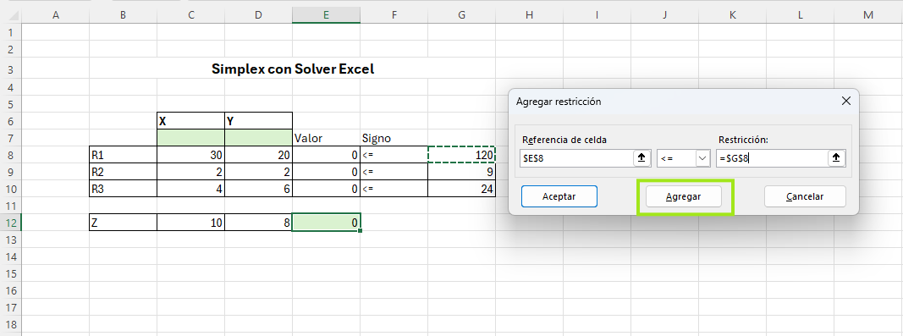

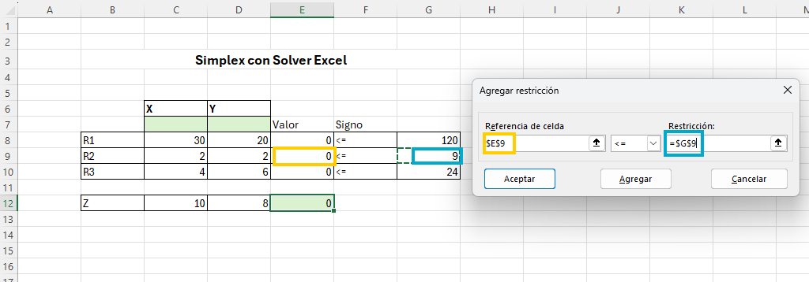
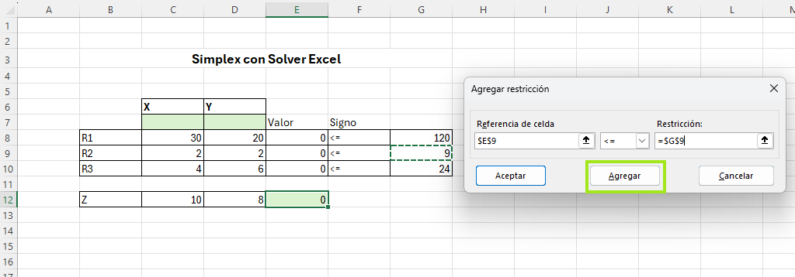

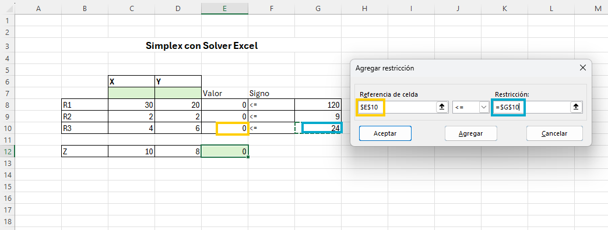
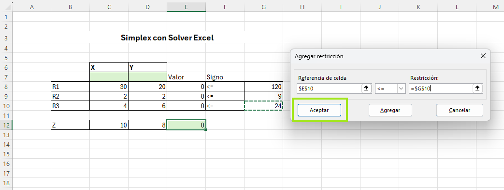


## Paso 8: Seleccionar método de resolución

Selecciona el método:

**Simplex LP**

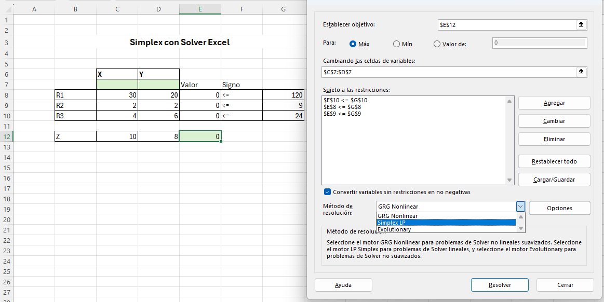


## Paso 9: Ejecutar Solver

Haz clic en **Resolver** para obtener la solución óptima.

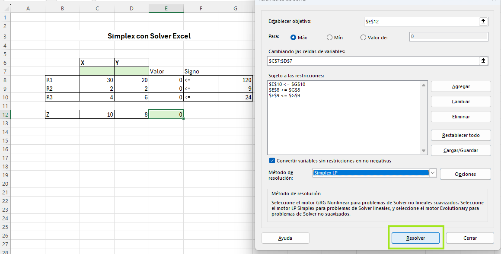
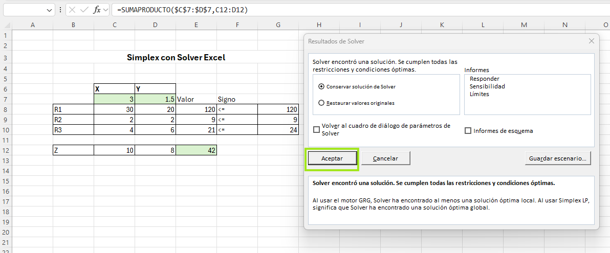


## Paso 10: Analizar resultados

> Observa los valores obtenidos para las variables de decisión.
> Analiza el valor óptimo de la función objetivo.
> Confirma que Solver encontró una solución válida.

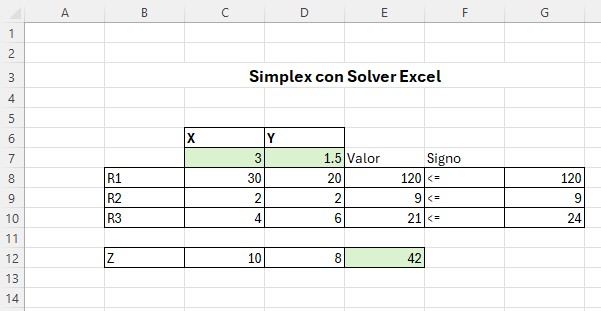


> [!NOTE]
> Las variables de decisión pueden inicializarse en cero o dejarse vacias, ya que Solver ajusta automáticamente sus valores para encontrar la solución óptima.

> [!IMPORTANT]
> Este procedimiento permite resolver modelos de programación lineal de forma eficiente utilizando herramientas computacionales.

> [!WARNING]
> Un error en la formulación de restricciones puede generar resultados incorrectos, por lo que deben verificarse cuidadosamente.
