# Ejemplo: Modelo de transporte con Solver en Excel

En este ejemplo se muestra cómo resolver un problema de transporte utilizando Excel Solver.

---

## Modelo

Minimizar:

Costo total de transporte

Sujeto a:

- Restricciones de oferta (producción)
- Restricciones de demanda
- No negatividad

---

## Paso 1: Construir la tabla de costos

Organiza los datos del problema en una tabla que incluya:

- Costos de transporte
- Oferta (producción)
- Demanda

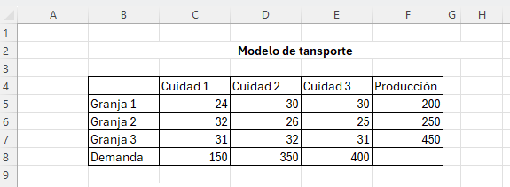
---

## Paso 2: Construir la matriz de variables

Crea una tabla donde se colocarán las variables de decisión.

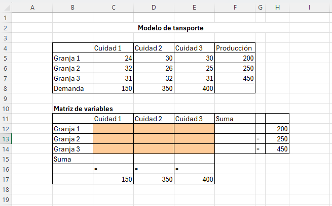

---

## Paso 3: Definir estructura de la matriz

Organiza filas (orígenes) y columnas (destinos).

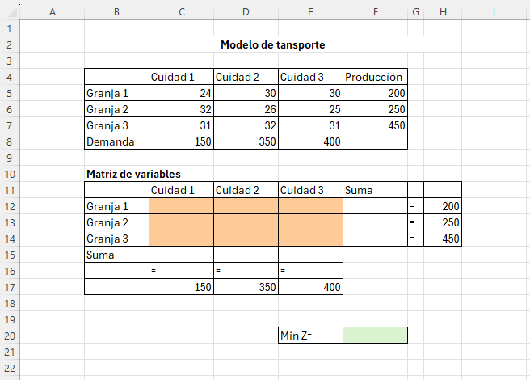

---

## Paso 4: Calcular suma por filas (oferta)

Utiliza la función:

[ =SUMA(C12:E12) ]

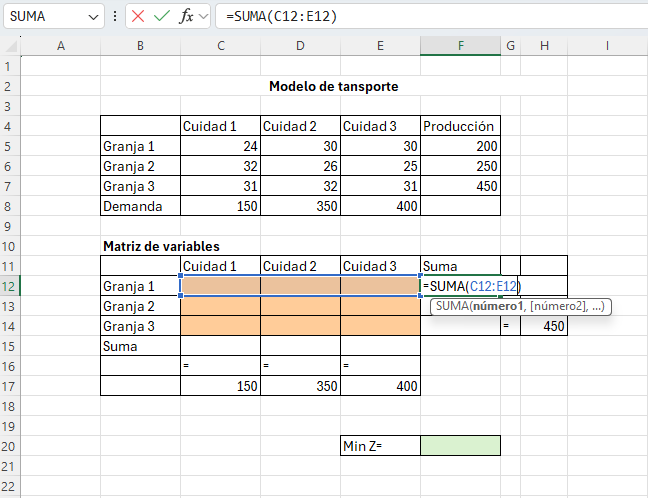

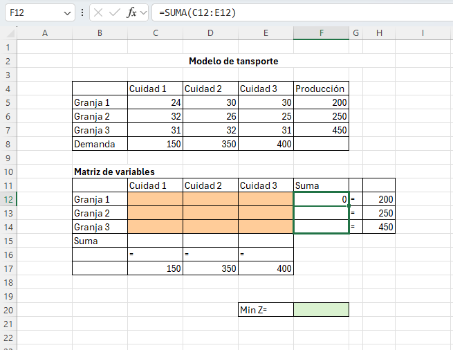

---

## Paso 5: Calcular suma por columnas (demanda)

Utiliza la función:

[ =SUMA(C12:C14) ]

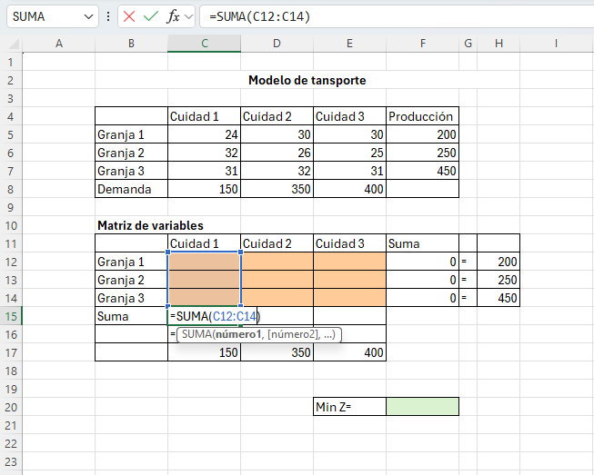

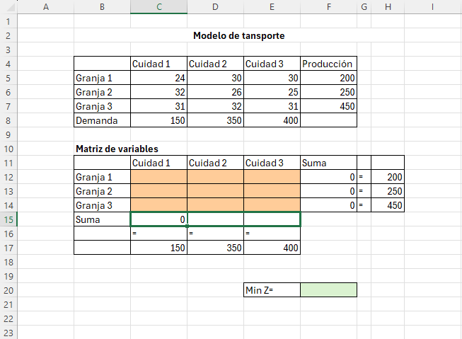

---

## Paso 6: Definir función objetivo

Utiliza:

[ =SUMAPRODUCTO(C5:E7, C12:E14) ]

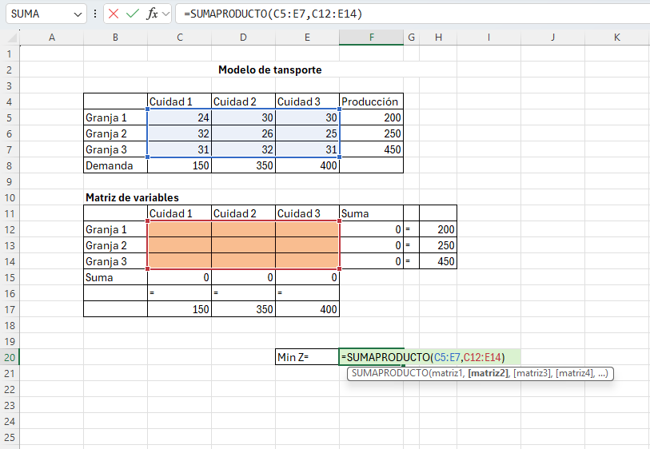

---

## Paso 7: Abrir Solver

Dirígete a:

**Datos → Solver**

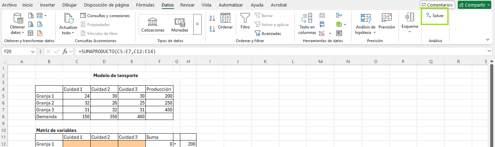

---

## Paso 8: Configurar objetivo

- Selecciona la celda del costo total
- Elegir opción **Min**

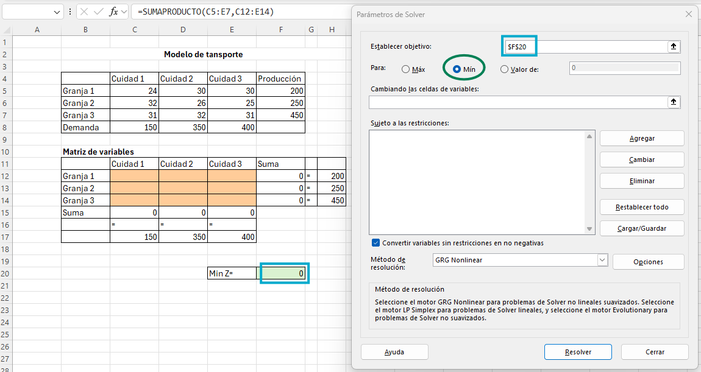

---

## Paso 9: Variables de decisión

Selecciona la matriz de variables:

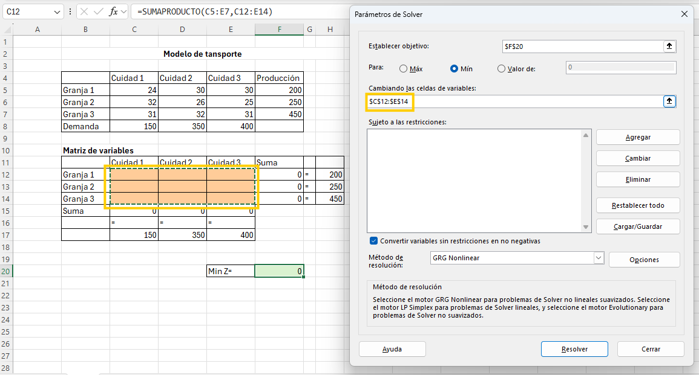

---

## Paso 10: Restricciones de oferta

Suma de filas = producción 

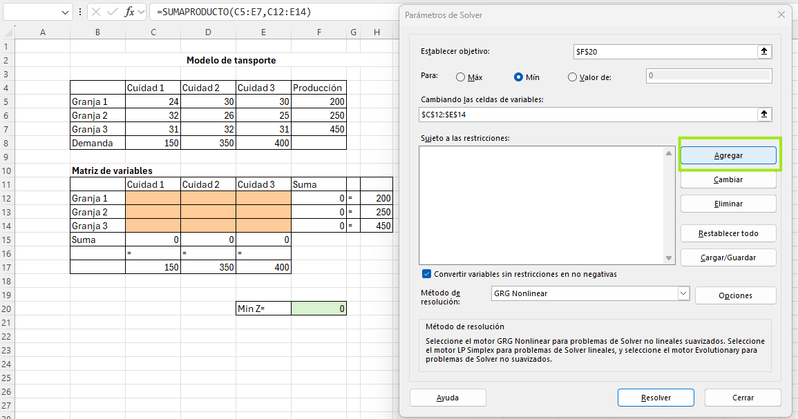

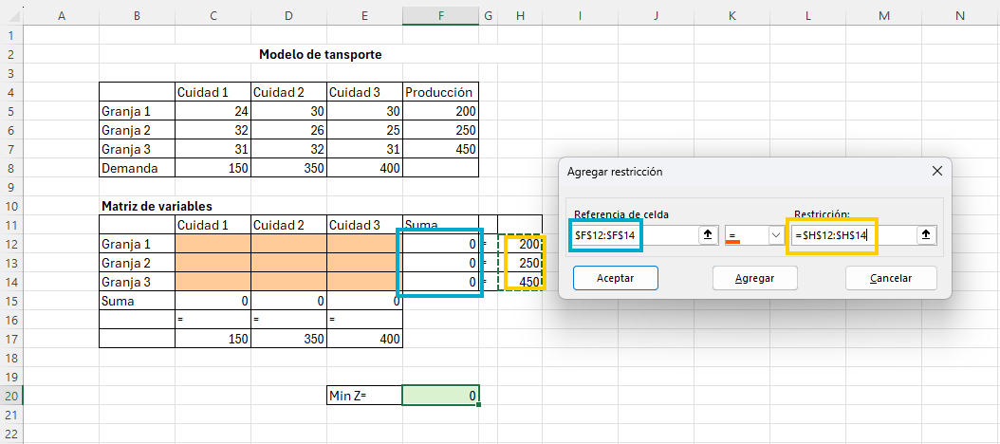

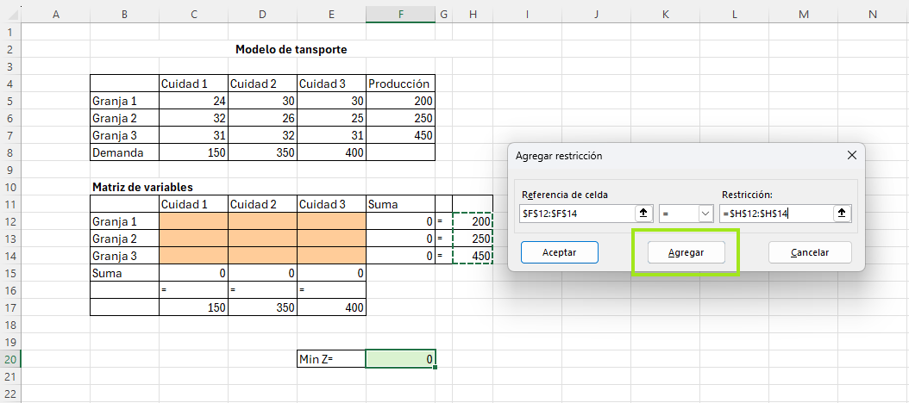

---

## Paso 11: Restricciones de demanda

Suma de columnas = demanda

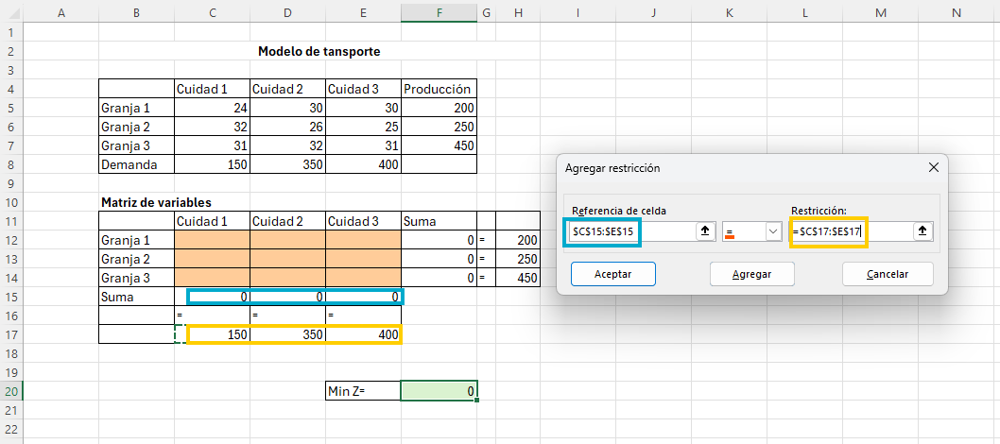

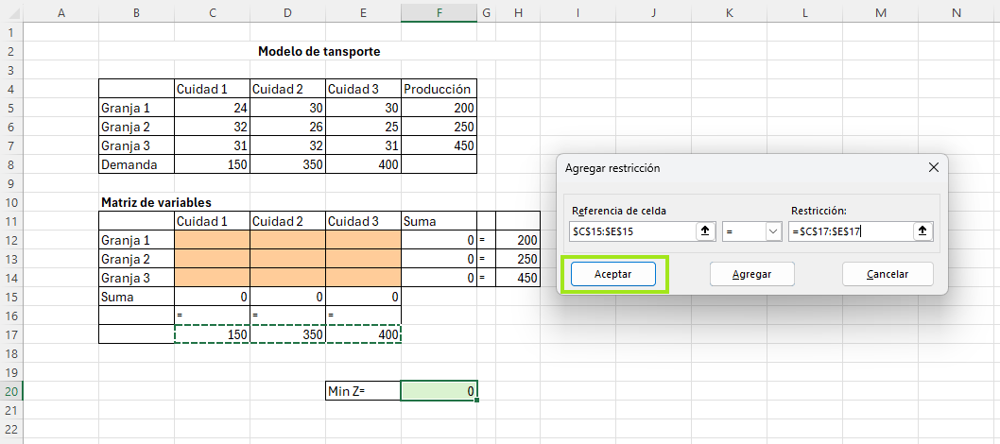

---

## Paso 12: Método de solución

Selecciona:

**Simplex LP**

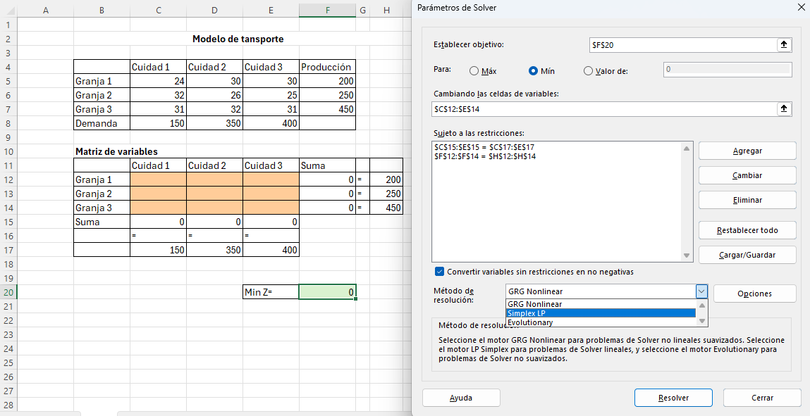

---

## Paso 13: Ejecutar Solver

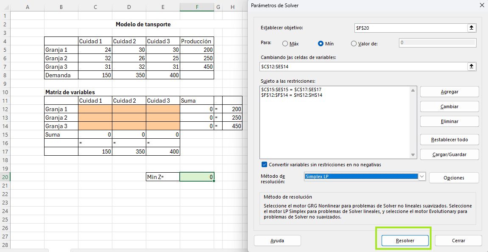

---

## Paso 14: Resultado

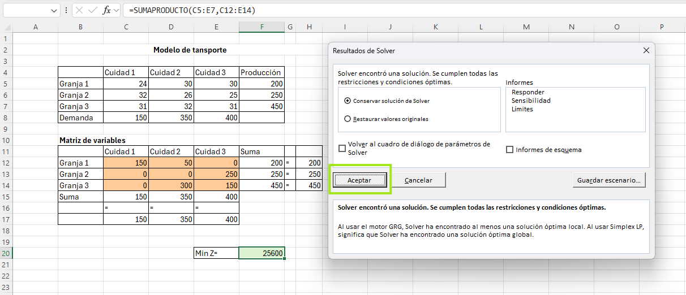

---

## Paso 15: Valor óptimo

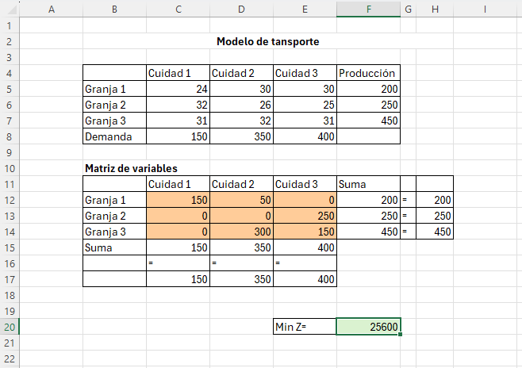

---

## Interpretación

La solución indica cuántas unidades deben enviarse desde cada origen hacia cada destino para minimizar el costo total de transporte.

El valor óptimo representa el costo mínimo total.

---

> [!NOTE]
> El modelo de transporte es un caso especial de programación lineal altamente eficiente para problemas de distribución.

> [!IMPORTANT]
> Es necesario que la suma de oferta sea igual a la suma de demanda para garantizar solución factible.

> [!WARNING]
> Errores en las restricciones pueden generar soluciones incorrectas o problemas sin solución.
